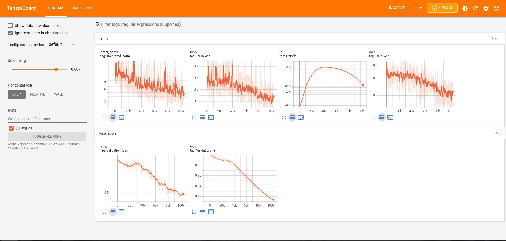

# :zap: FINETUNE WAV2VEC 2.0 FOR SPEECH RECOGNITION
[](https://paperswithcode.com/sota/speech-recognition-on-common-voice-vi?p=wav2vec2-base-vietnamese-160h)
[](https://paperswithcode.com/sota/speech-recognition-on-vivos?p=wav2vec2-base-vietnamese-160h)
### Table of contents
1. [Documentation](#documentation)
2. [Available Features](#feature)
3. [Installation](#installation)
4. [Train](#train)
5. [Inference](#inference)
6. [Logs and Visualization](#logs)
7. [Citation](#citation)
8. [Vietnamese](#vietnamese)


<a name = "documentation" ></a>
### Documentation
Suppose you need a simple way to fine-tune the Wav2vec 2.0 model for the task of Speech Recognition on your datasets, then you came to the right place.
</br>
All documents related to this repo can be found here:
- [Wav2vec2ForCTC](https://huggingface.co/docs/transformers/model_doc/wav2vec2#transformers.Wav2Vec2ForCTC)
- [Tutorial](https://huggingface.co/blog/fine-tune-wav2vec2-english)

<a name = "feature" ></a>
### Available Features
- [x] Multi-GPU training
- [x] Automatic Mix Precision
- [ ] Push to Huggingface Hub

<a name = "installation" ></a>
### Installation
```
pip install -r requirements.txt
```

<a name = "train" ></a>
### Train
1. Prepare your dataset
    - Your dataset can be in <b>.txt</b> or <b>.csv</b> format.
    - <b>path</b> and <b>transcript</b> columns are compulsory. The <b>path</b> column contains the paths to your stored audio files, depending on your dataset location, it can be either absolute paths or relative paths. The <b>transcript</b> column contains the corresponding transcripts to the audio paths. 
    - Check out our [example files](examples/train_data_examples/) for more information.
    * <b>Important:</b> Ignoring these following notes is still OK but can hurt the performance.
        - <strong>Make sure that your transcript contains words only</strong>. Numbers should be converted into words and special characters such as ```r'[,?.!\-;:"“%\'�]'``` are removed by default,  but you can change them in the [base_dataset.py](base/base_dataset.py) if your transcript is not clean enough. 
        - If your transcript contains special tokens like ```bos_token, eos_token, unk_token (eg: <unk>, [unk],...) or pad_token (eg: <pad>, [pad],...))```. Please specify it in the [config.toml](config.toml) otherwise the Tokenizer can't recognize them.
2. Configure the [config.toml](config.toml) file: Pay attention to the <b>pretrained_path</b> argument, it loads "facebook/wav2vec2-base" pre-trained model from Facebook by default. If you wish to pre-train wav2vec2 on your dataset, check out this [REPO](https://github.com/khanld/Wav2vec2-Pretraining).
3. Run
    - Start training from scratch:
        ```
        python train.py -c config.toml
        ```
    - Resume:
        ```
        python train.py -c config.toml -r
        ```
    - Load specific model and start training:
        ```
        python train.py -c config.toml -p path/to/your/model.tar
        ```

<a name = "inference" ></a>
### Inference
We provide an inference script that can transcribe a given audio file or even a list of audio files. Please take a look at the arguments below, especially the ```-f TEST_FILEPATH``` and the ```-s HUGGINGFACE_FOLDER``` arguments:
```cmd
usage: inference.py [-h] -f TEST_FILEPATH [-s HUGGINGFACE_FOLDER] [-m MODEL_PATH] [-d DEVICE_ID]

ASR INFERENCE ARGS

optional arguments:
  -h, --help            show this help message and exit
  -f TEST_FILEPATH, --test_filepath TEST_FILEPATH
                        It can be either the path to your audio file (.wav, .mp3) or a text file (.txt) containing a list of audio file paths.
  -s HUGGINGFACE_FOLDER, --huggingface_folder HUGGINGFACE_FOLDER
                        The folder where you stored the huggingface files. Check the <local_dir> argument of [huggingface.args] in config.toml. Default
                        value: "huggingface-hub".
  -m MODEL_PATH, --model_path MODEL_PATH
                        Path to the model (.tar file) in saved/<project_name>/checkpoints. If not provided, default uses the pytorch_model.bin in the
                        <HUGGINGFACE_FOLDER>
  -d DEVICE_ID, --device_id DEVICE_ID
                        The device you want to test your model on if CUDA is available. Otherwise, CPU is used. Default value: 0
```

Transcribe an audio file:
```cmd
python inference.py \
    -f path/to/your/audio/file.wav(.mp3) \
    -s huggingface-hub

# output example:
>>> transcript: Hello World 
```

Transcribe a list of audio files. Check the input file [test.txt](examples/inference_data_examples/test.txt) and the output file [transcript_test.txt](examples/inference_data_examples/transcript_test.txt) (which will be stored in the same folder as the input file):
```cmd
python inference.py \
    -f path/to/your/test.txt \
    -s huggingface-hub
```


<a name = "logs" ></a>
### Logs and Visualization
The logs during the training will be stored, and you can visualize it using TensorBoard by running this command:
```
# specify the <project_name> in config.json
tensorboard --logdir ~/saved/<project_name>

# specify a port 8080
tensorboard --logdir ~/saved/<project_name> --port 8080
```


<a name = "citation" ></a>
### Citation 
[](https://zenodo.org/badge/latestdoi/491468343)
```text
@software{Duy_Khanh_Finetune_Wav2vec_2_0_2022,
    author = {Duy Khanh, Le},
    doi = {10.5281/zenodo.6540979},
    month = {5},
    title = {{Finetune Wav2vec 2.0 For Speech Recognition}},
    url = {https://github.com/khanld/ASR-Wa2vec-Finetune},
    year = {2022}
}
```
<a name = "vietnamese" ></a>
### Vietnamese
Please take a look [here](examples/vietnamese-tutorial) for Vietnamese people who want to train on public datasets like  [VIOS](https://huggingface.co/datasets/vivos), [COMMON VOICE](https://huggingface.co/datasets/mozilla-foundation/common_voice_8_0), [FOSD](https://data.mendeley.com/datasets/k9sxg2twv4/4), and [VLSP](https://vlsp.org.vn/vlsp2020/eval/asr).
